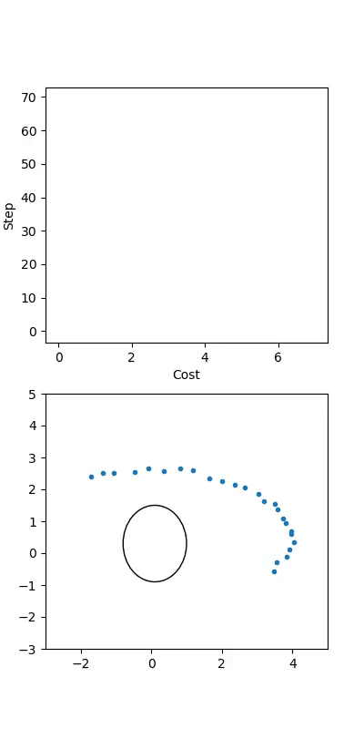
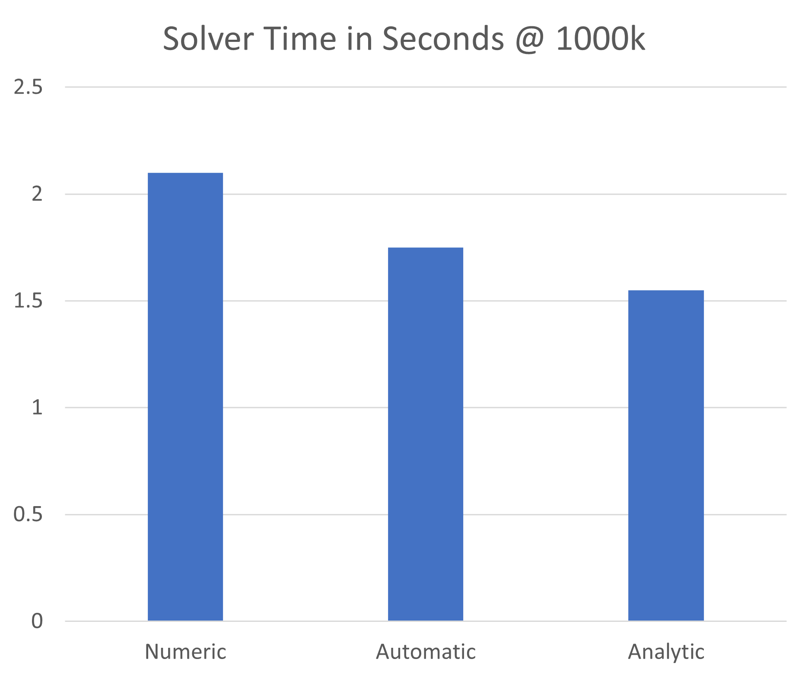

<style>
table {
  font-size: 70%;
}
</style>

# **Intro to Ceres Solver**

Matthew Johnson

---

# What is it?

> an open source C++ library for modeling and solving large,
> complicated optimization problems. It can be used to solve
> Non-linear Least Squares problems with bounds constraints
> and general unconstrained optimization problems. It is a
> mature, feature rich, and performant library that has been
> used in production at Google since 2010.

https://ceres-solver.org

---

# Fitting an ellipse



$$
C(h, k, a, b) = \sum_i \left( \frac{(x_i - h)^2}{a^2} + \frac{(y_i - k)^2}{b^2} - 1 \right)^2
$$

```c++
Ellipse ellipse(0.1, 0.3, 0.9, 1.2);
ceres::Problem problem;
add_costs(problem, dataset, ellipse.params());
ceres::Solver::Options options;
ceres::Solver::Summary summary;
ceres::Solve(options, &problem, &summary);
std::cout << summary.BriefReport() << std::endl;
```

Main integration point is `add_costs`.

---

# Cost functions



- Numeric
    * Compute residual
    * Slower (finite differences)
- Automatic
    * Compute residual + templates
    * Faster (autodiff)
- Analytic
    * Compute residual and Jacobian
    * Fastest

---

# Numeric

```c++
struct NumericEllipseCostFunctor
{
  bool operator()(const double *const parameters, double *residuals) const
  { 
    Ellipse<double> ellipse(parameters);
    const double dx = observed_point.x() - ellipse.h();
    const double dy = observed_point.y() - ellipse.k();
    const double a2 = ellipse.a() * ellipse.a();
    const double b2 = ellipse.b() * ellipse.b();
    residuals[0] = (dx * dx) / a2 + (dy * dy) / b2 - 1.0;
    return true;
  }
}
```

---

# Numeric

Once the class is written, we can add per-observation cost
like so:

```c++
using cost_t = ceres::NumericDiffCostFunction<NumericEllipseCostFunctor,
                                              ceres::CENTRAL, // method to use
                                              1,              // # residuals
                                              4>;             // # params
for(auto i = 0; i < dataset.cols(); ++i)
{
  ceres::CostFunction *cost_function = 
      new cost_t(new NumericEllipseCostFunctor(dataset.col(i)));
  problem.AddResidualBlock(cost_function, nullptr, params);
}
```

---

# Autodiff

```c++
struct AutoEllipseCostFunctor
{
  template <typename T>
  bool operator()(const T *const parameters, T *residuals) const
  { 
    Ellipse<T> ellipse(parameters);
    const T dx = T(observed_point.x()) - ellipse.h();
    const T dy = T(observed_point.y()) - ellipse.k();
    const T a2 = ellipse.a() * ellipse.a();
    const T b2 = ellipse.b() * ellipse.b();
    residuals[0] = (dx * dx) / a2 + (dy * dy) / b2 - T(1.0);
    return true;
  }
}
```

---

# Autodiff

Once the class is written, we can add per-observation cost
like so:

```c++
using cost_t = ceres::AutoDiffCostFunction<AutoEllipseCostFunctor,
                                           1,              // # residuals
                                           4>;             // # params
for(auto i = 0; i < dataset.cols(); ++i)
{
  ceres::CostFunction *cost_function = 
      new cost_t(new AutoEllipseCostFunctor(dataset.col(i)));
  problem.AddResidualBlock(cost_function, nullptr, params);
}
```

---

# Analytic

$$
C(h, k, a, b) = \frac{(x_i-h)^2}{a^2} + \frac{(y_i-h)^2}{b^2} - 1 \\
\frac{\partial}{\partial h}C(h, k, a, b) = \frac{-2(x_i-h)}{a^2} \\
\frac{\partial}{\partial k}C(h, k, a, b) = \frac{-2(y_i-k)}{b^2} \\
\frac{\partial}{\partial a}C(h, k, a, b) = \frac{-2(x_i-h)^2}{a^3} \\
\frac{\partial}{\partial k}C(h, k, a, b) = \frac{-2(y_i-k)^2}{b^3} \\
$$

---

# Analytic

```c++
virtual bool Evaluate(double const *const *parameters,
                      double *residuals,
                      double **jacobians) const {
  // ...same as Numeric
  if (jacobians != nullptr && jacobians[0] != nullptr)
  {
    using jacobian_t = Eigen::Matrix<double, 1, 4, Eigen::RowMajor>;
    Eigen::Map<jacobian_t> jac(jacobians[0]);
    jac(0, 0) = (-2 * dx) / a2;
    jac(0, 1) = (-2 * dy) / b2;
    jac(0, 2) = (-2 * dx2) / (a2 * ellipse.a());
    jac(0, 3) = (-2 * dy2) / (b2 * ellipse.b());
  }
}
```

---

# Analytic

Once the class is written, we can add per-observation cost
like so:

```c++
for (auto i = 0; i < dataset.cols(); ++i)
{
    ceres::CostFunction *cost_function =
        new AnalyticEllipseCostFunction(dataset.col(i));
    problem.AddResidualBlock(cost_function, nullptr, params);
}
```

---

# Gradient Checker

```c++
ceres::CostFunction *cost_function = ...;
ceres::NumericDiffOptions numeric_diff_options;
ceres::GradientChecker gradient_checker(cost_function,
                                        nullptr,
                                        numeric_diff_options);
ceres::GradientChecker::ProbeResults results;
if (!gradient_checker.Probe(parameteres, tolerance, &results))
{
    std::cerr << "An error has occurred:\n"
              << results.error_log;
}
```

---

# Gradient checker

Sample error output:

```
An error has occurred:

Detected 1 bad Jacobian component(s). Worst relative error was 0.333333.

========== Jacobian for block 0: (1 by 4)) ==========
 block  row  col        user dx/dy    num diff dx/dy         abs error    relative error         parameter          residual
     0    0    0          -8.22788          -8.22788       1.06581e-14       1.29537e-15               0.1           13.1412
     0    0    1           1.09583           1.09583       4.21885e-15       3.84991e-15               0.3           13.1412
     0    0    2          -30.4641          -30.4641       9.76996e-13       3.20704e-14               0.9           13.1412
     0    0    3          -1.08076         -0.720507          0.360254          0.333333               1.2           13.1412 ------ (0,0,3) Relative error worse than 1e-09
```

---

# Setting constraints

```c++
void set_bounds(ceres::Problem& problem)
{
    problem.SetParameterLowerBound(params(), 2, 1e-5); // a
    problem.SetParameterLowerBound(params(), 3, 1e-5); // b
}
```

---

# Solver options

|          Option                  |                                  Definition                                                                           |
| -------------------------------- | ----------------------------------------------------------------------------------------------------------------------|
| `linear_solver_type`             | `DENSE_QR`,`DENSE_NORMAL_CHOLESKY`,`SPARSE_NORMAL_CHOLESKY`, `CGNR`, `DENSE_SCHUR`, `SPARSE_SCHUR`, `ITERATIVE_SCHUR` |
| `preconditioner_type`            | `IDENTITY`, `JACOBI`, `SCHUR_JACOBI`, `CLUSTER_JACOBI`, `CLUSTER_TRIDIAGONAL`                                         |
| `line_search_direction_type`     | `STEEPEST_DESCENT`, `NONLINEAR_CONJUGATE_GRADIENT`, `BFGS`, `LBGFS`                                                   |
| `line_search_type`               | `WOLFE`, `ARMIJO`                                                                                                     |
| `line_search_interpolation_type` | `CUBIC`, `BISECTION`, `QUADRATIC`                                                                                     |
| `max_num_iterations`             | Maximum number of minizer iterations                                                                                  |
| `max_solver_time_in_seconds`     | Maximum time solver is allowed to run (in seconds)                                                                    |
| `num_threads`                    | Number of threads used to evaluate the Jacobian                                                                       |

---

# Solver options

|            Option              |                 Definition                  |
| ------------------------------ | --------------------------------------------|
| `function_tolerance`           | Stopping condition for objective function   |
| `gradient_tolerance`           | Stopping condition for gradient values      |
| `parameter_tolerance`          | Stopping condition for parameter values     |
| `minimizer_progress_to_stdout` | Whether to log progress each iteration      |
| `check_gradients`              | Checks all gradients before solving         |
| `update_state_every_iteration` | Updates the parameters list each iteration  |
| `callbacks`                    | A vector of callback objects                |

---

# Solver callbacks

```c++
class CSVCallback : public ceres::IterationCallback
{
  explicit CSVCallback(const std::string &path, const double *params,
                       int num_observations);

  ceres::CallbackReturnType operator()(const ceres::IterationSummary &summary)
  {
    Ellipse<double> ellipse(m_params);
    m_output << summary.cost / m_num_observations << ","
             << ellipse.h() << "," << ellipse.k() << ","
             << ellipse.a() << "," << ellipse.b() << std::endl;
    return ceres::CallbackReturnType::SOLVER_CONTINUE;
  }
}
```

---

# Best Practices

- Create a "Parameters management" class (*e.g.* `Ellipse`)
    * Single owner of parameter block
    * Read-only semantic access to parameters
    * Handles boundary conditions
    * `to_string`
- Start with Numeric -> Autodiff -> Analytic (if needed)
- `Eigen::Map` allows for clean linear algebra

---

# Benefits

- Solving large problems (*e.g.* bundle adjustment)
- Prototyping
- Debugging analytical gradients

---

# Detriments

- Double-precision only
- Not build for online use